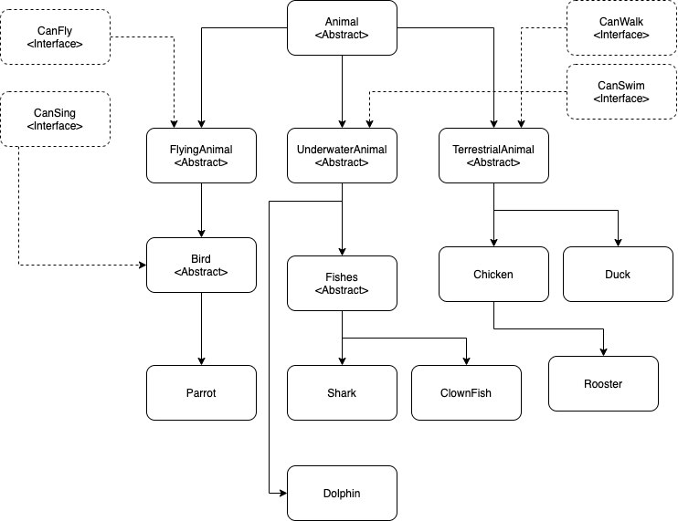
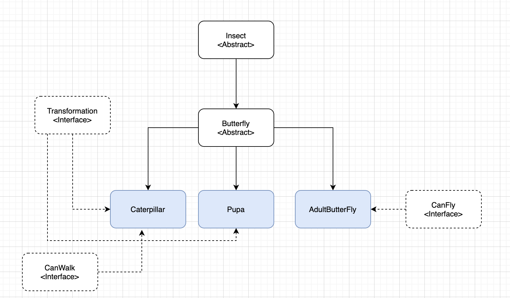

### Introduction
What I have not done!
> The unit test.

> The refactoring

Can you think of other ways to model a rooster without using inheritance?
> We can use composition instead of polymorphism

### Hierarchical
##### A. Animal Hierarchical.

##### B. Insect Hierarchical.

